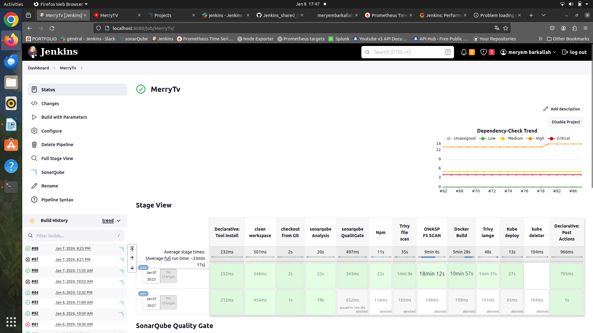
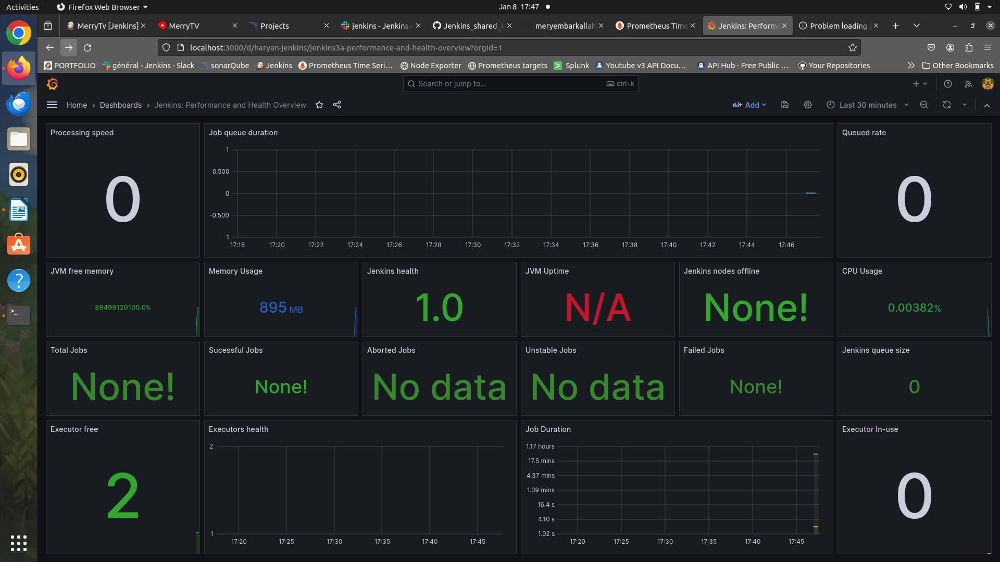
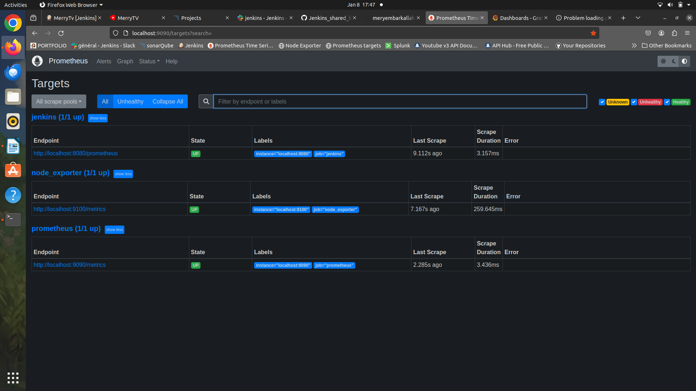
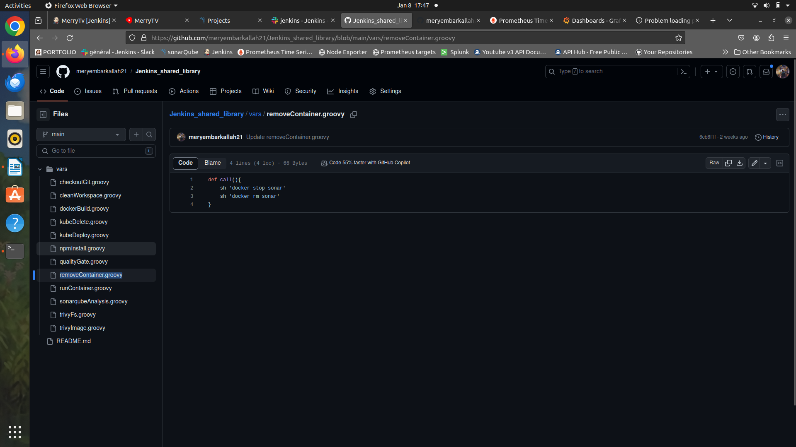
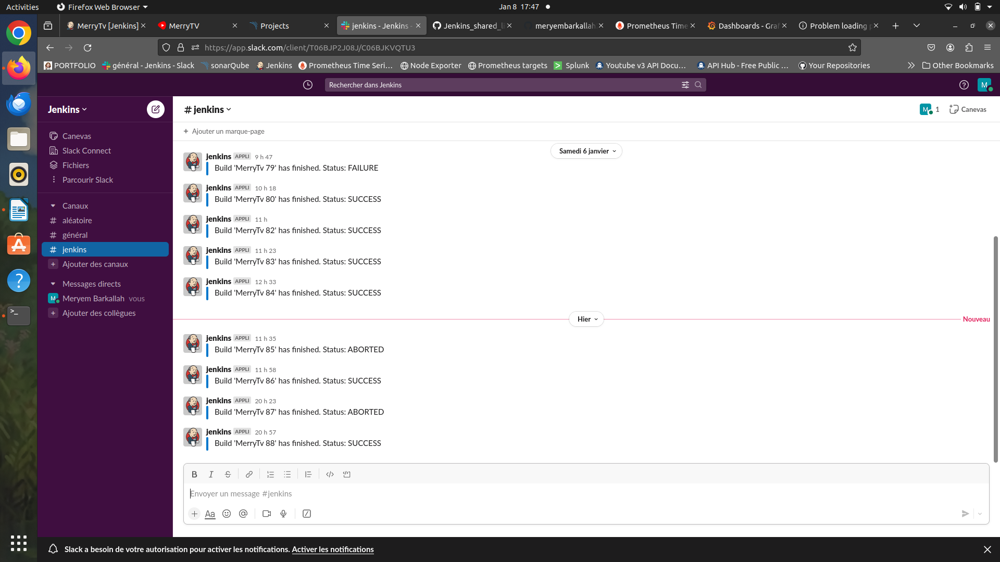
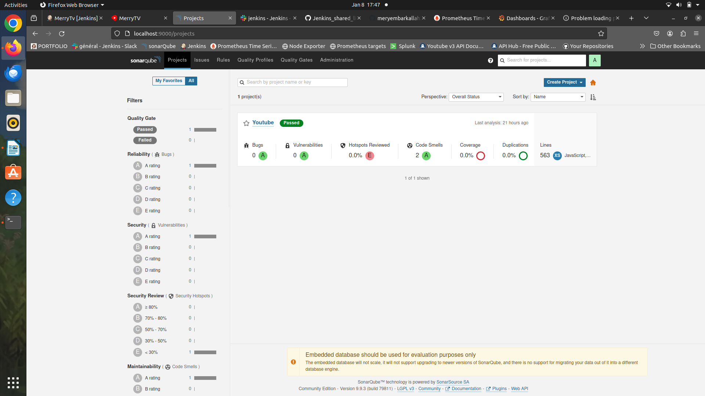
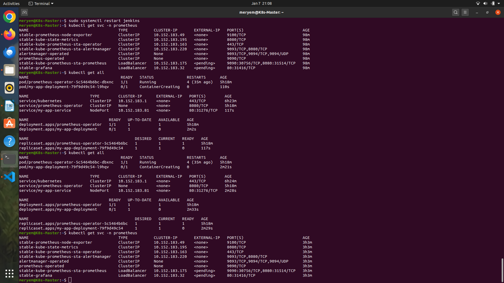
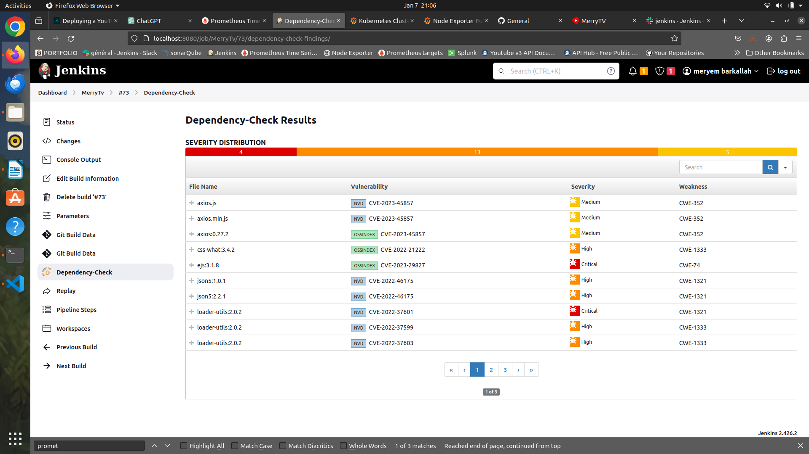
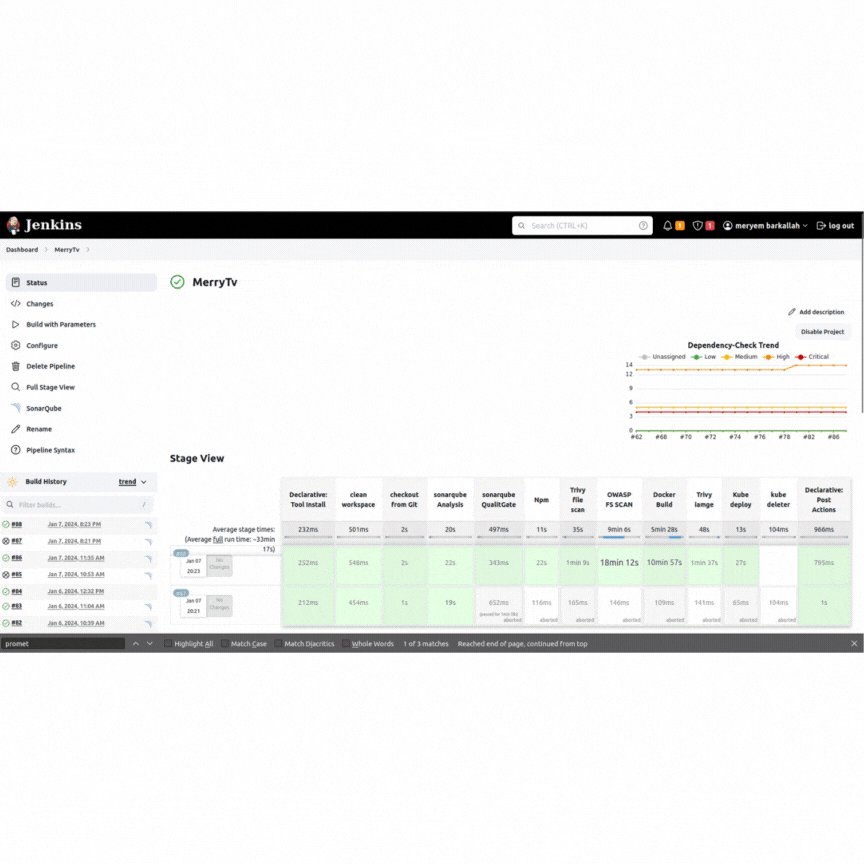

# MerryTV 🌐🚀

## Overview

MerryTV is a DevOps school project that integrates various tools and technologies to streamline the development and deployment process. 🛠️💻 

## Tools Used

### Jenkins

[Jenkins](https://www.jenkins.io/) is employed as the automation server, providing a robust platform for building, deploying, and automating projects.

### Docker

[Docker](https://www.docker.com/) facilitates seamless containerization, ensuring consistency across different environments and simplifying deployment.

### Trivy

[Trivy](https://github.com/aquasecurity/trivy) is integrated to enhance container security by scanning Docker images for vulnerabilities.

### Slack

[Slack](https://slack.com/) is employed for effective communication and real-time notifications. Jenkins CI app integration ensures immediate updates.

### Jenkins Shared Library

The [Jenkins Shared Library](https://github.com/meryembarkallah21/Jenkins_shared_library) contains essential scripts for various tasks, enhancing reusability and maintaining a consistent pipeline structure. Key scripts include:

- `checkoutGit.groovy`
- `cleanWorkspace.groovy`
- `dockerBuild.groovy`
- `kubeDelete.groovy`
- `kubeDeploy.groovy`
- `npmInstall.groovy`
- `qualityGate.groovy`
- `removeContainer.groovy`
- `runContainer.groovy`
- `sonarqubeAnalysis.groovy`
- `trivyFs.groovy`
- `trivyImage.groovy`

## Jenkins Pipeline 🚀

The Jenkins pipeline is structured to automate builds and deployments. It starts by triggering a job, utilizing a shared library stored in GitHub for reusability. The pipeline includes stages for installing plugins, configuring tools, integrating SonarQube for code quality checks, and adding custom stages for a tailored workflow.

## Security and Quality Checks 🛡️

- [OWASP Dependency Check](https://owasp.org/www-project-dependency-check/) is implemented to identify vulnerabilities in project dependencies.
- [SonarQube](https://www.sonarqube.org/) is integrated for continuous code quality checks.

## Docker & API Integration 🐳

Automated Docker image builds and push to a container registry are achieved, along with secure API interactions using an API key from Rapid API.

## Kubernetes Integration 🚢

- **Helm for Kubernetes Application Management:**
  Utilize [Helm](https://helm.sh/) to simplify the management and deployment of applications on Kubernetes.

- **Prometheus for Monitoring:**
  Implement [Prometheus](https://prometheus.io/) for robust monitoring, collecting and processing real-time metrics.

- **Grafana for Visualization:**
  Leverage [Grafana](https://grafana.com/) to create interactive and customizable dashboards, providing optimal visualization of Prometheus metrics.

- **Customizing Prometheus Service:**
  Tailor the Prometheus service configuration to ensure optimal performance for collecting and storing metrics.

- **Customizing Grafana Service:**
  Fine-tune Grafana service settings to meet specific visualization requirements.

- **Kubernetes Deployment:**
  Deploy applications to Kubernetes, ensuring scalability and efficient container management.
  
## Screenshots 📸📊

  

